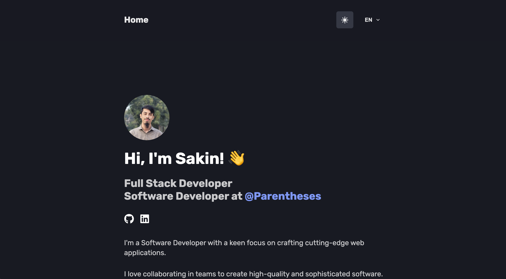

<h1 align="center">
<a href="https://tasakin.me">
  tasakin.me</a>
</h1>



## ✨ Inspiration

This project has been heavily inspired from [ironsoul.lol]('https://github.com/ironsoul0/ironsoul.ninja#--ironsoulninja-').

## 🛠 Wanna run on your machine?

1. Clone the project

   ```sh
   git clone https://github.com/ta-sakin/tasakin.me
   ```

2. Install the dependencies

   ```sh
   cd tasakin.me
   npm i
   ```

3. Start the development server

   ```sh
   npm run dev
   ```
